<h1 align="center">nilAI</h1>

 The live link can be found here - [nilAI Landing Page](https://sass-landing-stripe-frontend.onrender.com/)

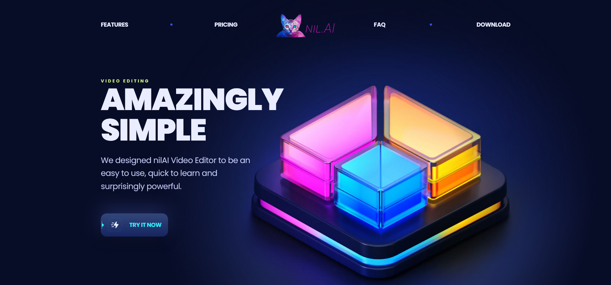

## Contents
* [About The Project](#about-the-project)
    * [Description](#description)
    * [Built With](#build-with)
* [Project Goals and UX](#project-goals-and-ux)
    * [Project Goals](#Project-Goals)
    * [User Stories](#User-Stories)
* [Design](#Design)
    <!-- * [Wireframes](#Wireframes) -->
    * [Colour Scheme](#Colour-Scheme)
    * [Fonts](#Fonts)
* [Features](#Features)
    * [Features](#Features)
        * [Reuseable Components](#reuseable-components)
        * [Pricing](#pricing)
        * [Stripe Payment Gateway](#stripe-payment-gateway)
        * [Responsive View](#responsive-view)
    * [Future Features](#Future-Features)
* [Testing](#Testing)
    * [Accessibility Testing](#Accessibility-Testing)
    * [Manual Testing](#Manual-Testing)
* [Deployment](#Deployment)
    * [Cloning & Forking](#Cloning-&-Forking)
    * [Remote Deployment](#Remote-Deployment)

***

 

## About The Project

### Description

The nilAI is a modern way designed single-page website for your SaaS product or another advertisment. Beautiful reuseable components make it smooth to navigate. With fully working backend you are available to make a test payment in Stripe Payment Gateway- very well known payment gatway in the web industry.

  

### Built With

[![React][React.js]][React-url] [![Tailwind][Tailwind]][Tailwind-url] [![Express][Express]][Express-url] [![Node][Node]][Node-url] 

  

## Project Goals and UX

### Project Goals
* The Goal of the project is to make a website designed in the modern way. 

* It has been designed for people who want to advertise their products or promote themself!

* For the learning purposes.

### User Stories
|Story No.|Story|
| ------------- | ------------- |
|1|As an user,   I want to be able to play the music  so that I can listen to my favorite songs.   I know I am done when the user can play the music from Player or by clicking on song on Home screen. |
|2|As an user,   I want to be able to pause the music  so that I can come back and continue my listening.   I know I am done when the user can pause the music in the Player. |
|3|As an user,   I want to be able to play previous/next song  so that I can repeat or skip the song I want.   I know I am done when Player's previous/next buttons  are working as desired. |
|4|As an user,   I want to be able to open the Album details  so that I can see what I can listen to.  I know I am done when user is navigated to Album item  after clicking on it. |
|5|As an user,   I want to be play any song by clicking on it on  Home screen  so that will make it simple.  I know I am done when music plays after user clicked on  any song on Home screen. |

## Design

### Colour Scheme

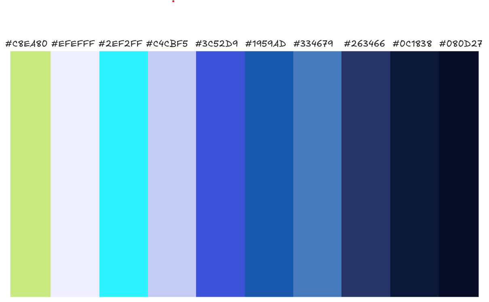

### Fonts

The Google Fonts used in this project:
* Poppins

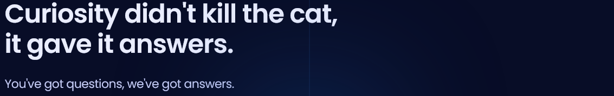

* Inter

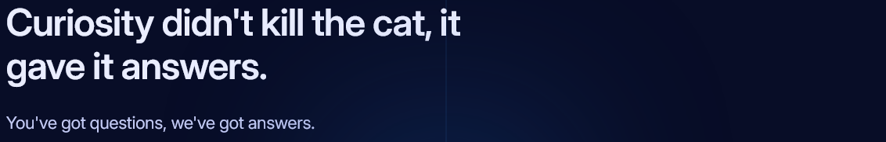

## Features

### Reuseable Components
Some examples of reuseable components used in this project:

<table border="0" >
 <tr align="center">
    <td><b style="font-size:15px">Button #1</b></td>
    <td><b style="font-size:15px">Button #2</b></td>
    <td><b style="font-size:15px">Styled Image</b></td>

 </tr>
 <tr align="center">
    <td></td>
    <td></td>
    <td>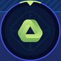</td>

 </tr>
  <tr align="center">
    <td></td>
    <td></td>
    <td></td>

 </tr>
  <tr align="center">
    <td></td>
    <td>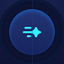</td>
    <td></td>

 </tr>
</table>

### Pricing

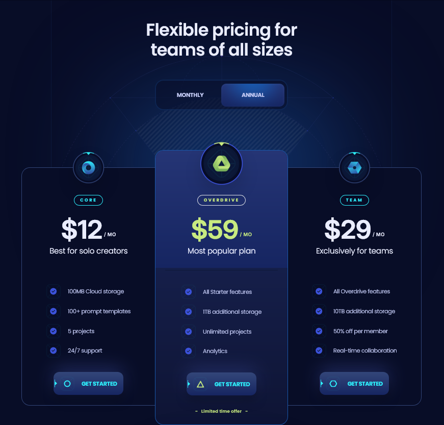
  

### Stripe Payment Gateway
Render you to Test Stripe Gateway, availbility to make a test payment!

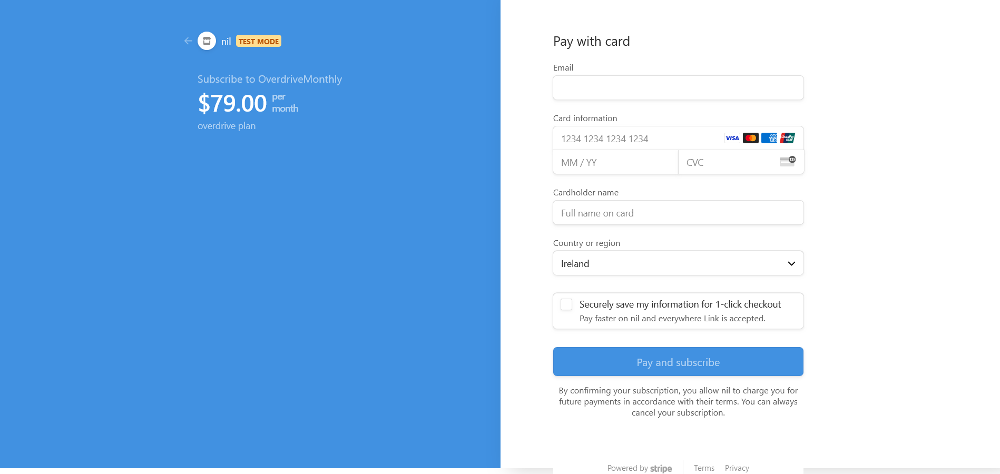
  

### Responsive View

Desktop View - <b>CLICK</b> to see

#### Header

#### Footer
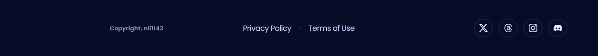

#### Home Page
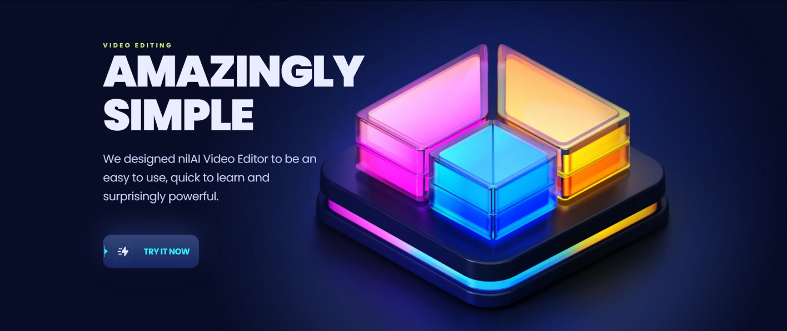

#### Features Section
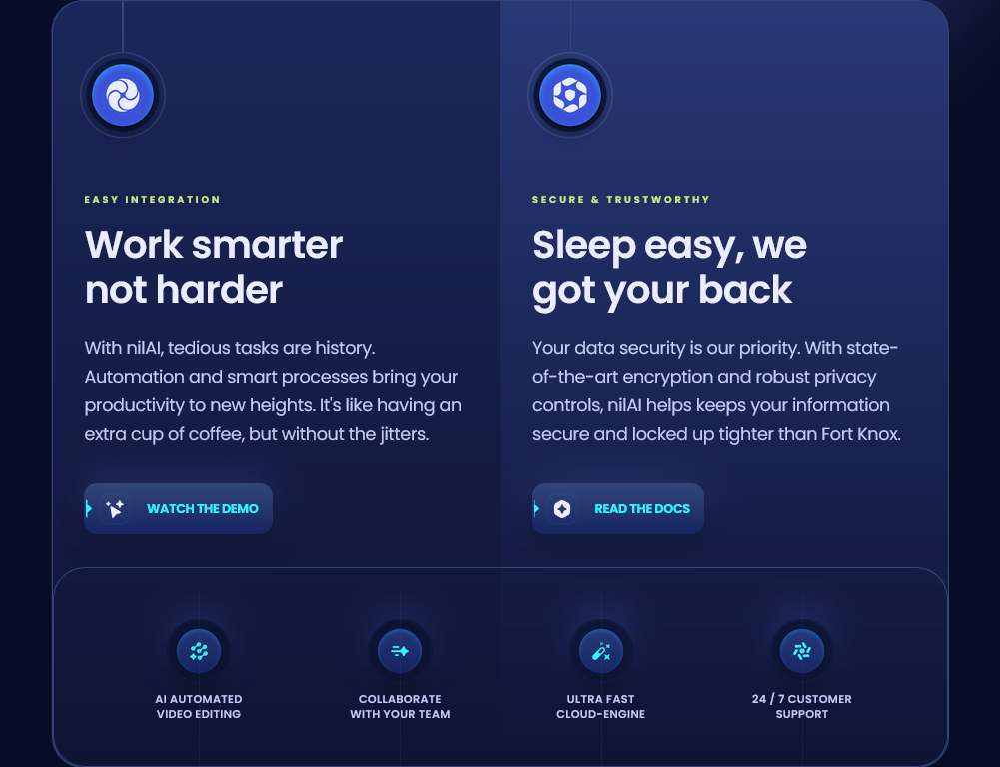

#### Pricing Section

#### Faq Section
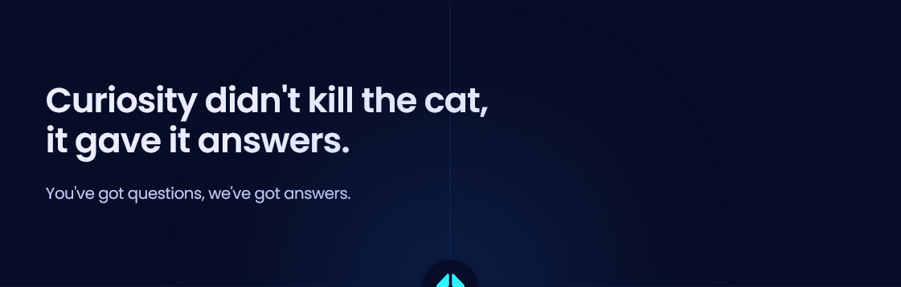
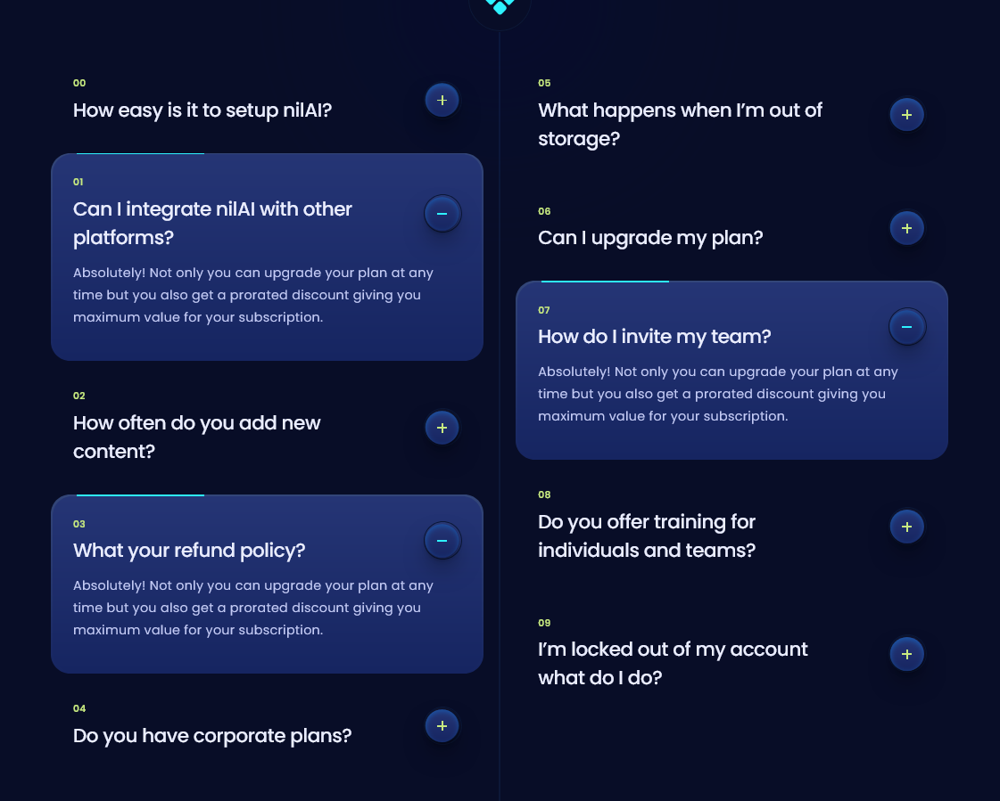

#### Download Section
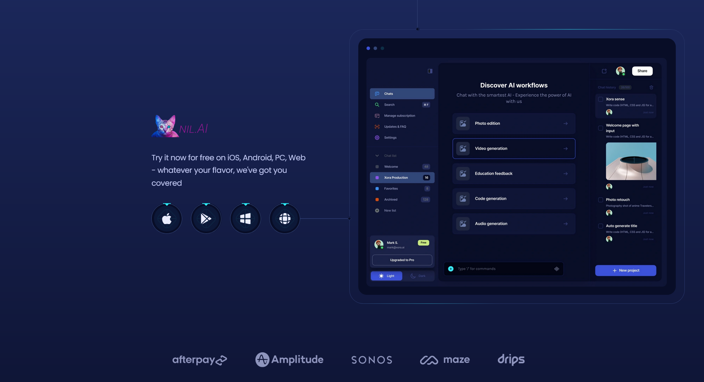

 

Mobile View - <b>CLICK</b> to see

#### Home Section
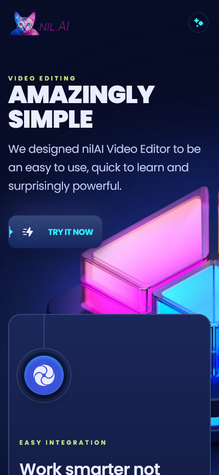

#### Features Section
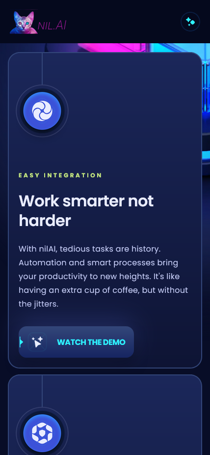

#### Pricing Section
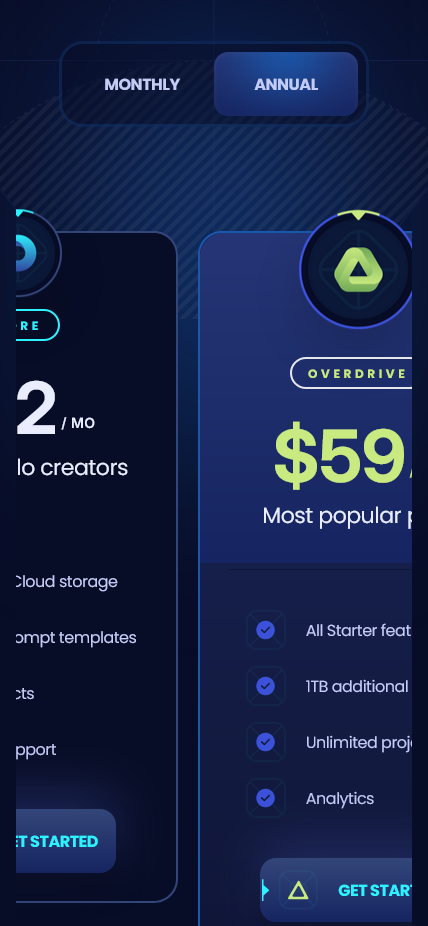

#### Faq Section
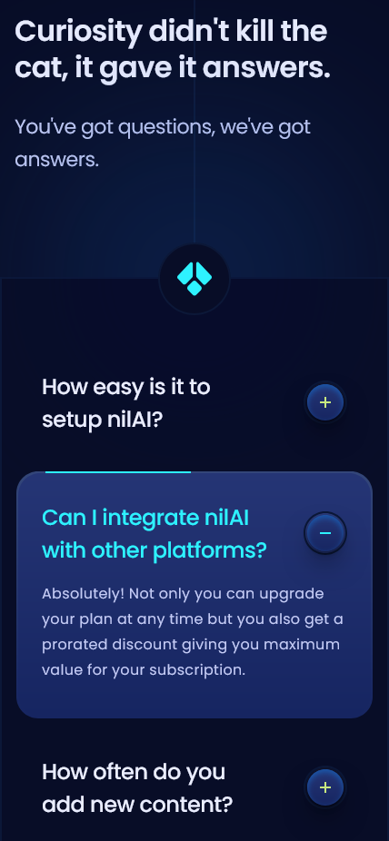

#### Testimonials Section
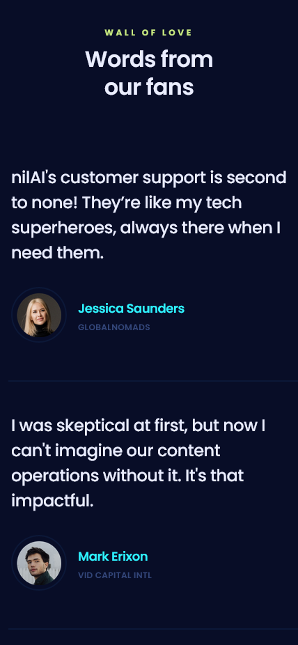

#### Download Section
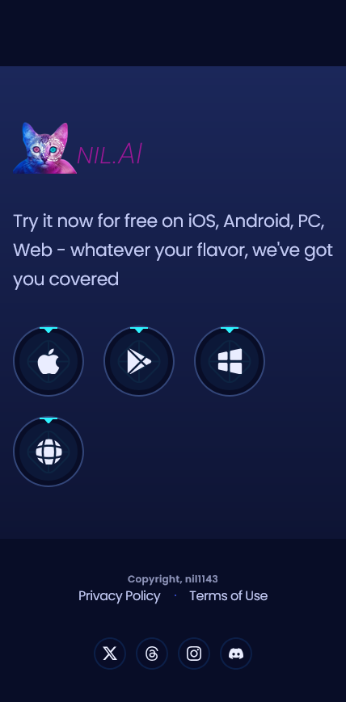

 

---

### Future Features 

* Authentication system

* Stripe hooks functionality for authenticated subscirber

## Testing

### Accessibility Testing
#### Lighthouse
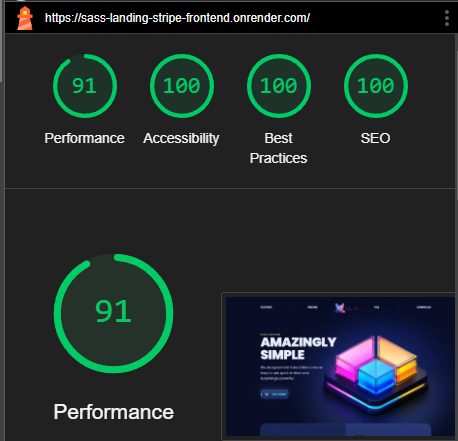

### Manual Testing
- I have tested that this page works in different web browsers.
- I have tested that the project is responsive and works with different device sizes. Looks good and functions as usual. 
- I have tested all links, internal and external. They go to the correct destination and open in the correct way. 
- I have tested that all text and fonts are readable and easy to understand.
- I have tested that the correct data is passed when the forms are submitted. 
- I have tested a navigation in the header to make sure it navigate you to correct sections.
- I have tested that pricing Monthly/Yearly button counting values correctly.
- I have tested that chosen play navigates you to Stripe Payment Gateway.
- I have tested that you are able to make a test payment with message received.

## Deployment

### Cloning & Forking
#### Fork
1. On GitHub.com, navigate to the [nil1143/saas_landing_stripe](https://github.com/nil1143/saas_landing_stripe) repository.
2. In the top-right corner of the page, click Fork.
3. By default, forks are named the same as their parent repositories. You can change the name of the fork to distinguish it further.
4. Add a description to your fork.
5. Click Create fork.

#### Clone
1. Above the list of files click the button that says 'Code'.
2. Copy the URL for the repository.
3. Open Terminal. Change the directory to the location where you want the cloned directory.
4. Type git clone, and then paste the URL.
5. Press Enter.

### Remote Deployment
 The site was deployed to Github pages. If you have forked/cloned the repository the steps to deploy are:
 1. On GitHub.com, navigate to your repository.
 2. Navigate to the settings tab.
 3. Click on the tab called 'pages' on the left hand side.
 4. From the source drop down list under the heading Build and deployment, select main.
 5. The page will hten provide the link to the website.
 
 
 
 

[![Github][Github]][Github-url] [![LinkedIn][LinkedIn]][Linkedin-url]

<!-- MARKDOWN LINKS & IMAGES -->
[Mongodb]: https://img.shields.io/badge/-MongoDB-black.svg?style=for-the-badge&logo=mongodb&colorB=555
[Mongodb-url]: https://www.mongodb.com/atlas
[Express]: https://img.shields.io/badge/-express-white.svg?style=for-the-badge&logo=express&colorB=333
[Express-url]: https://expressjs.com/
[React.js]: https://img.shields.io/badge/React-20232A?style=for-the-badge&logo=react&logoColor=61DAFB
[React-url]: https://reactjs.org/
[Node]: https://img.shields.io/badge/node-black.svg?style=for-the-badge&logo=nodedotjs&colorB=333
[Node-url]: https://nodejs.org/
[Github]: https://img.shields.io/badge/github-black.svg?style=for-the-badge&logo=github&colorB=333
[Github-url]: https://github.com/nil1143
[LinkedIn]: https://img.shields.io/badge/-LinkedIn-black.svg?style=for-the-badge&logo=linkedin&colorB=555
[LinkedIn-url]: https://www.linkedin.com/in/tomasz-nilipiuk-b5b88a239/
[Tailwind]: https://img.shields.io/badge/Tailwind-blue.svg?style=for-the-badge&logo=tailwind-css&colorB=EFEFFF
[Tailwind-url]: https://tailwindcss.com/
