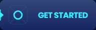

<h1 align="center">nilAI</h1>

 The live link can be found here - [nilAI Landing Page](https://saas-landing-pi.vercel.app/)

## Contents
* [About The Project](#about-the-project)
    * [Description](#description)
    * [Built With](#build-with)
* [Project Goals and UX](#project-goals-and-ux)
    * [Project Goals](#Project-Goals)
    * [User Stories](#User-Stories)
* [Design](#Design)
    <!-- * [Wireframes](#Wireframes) -->
    * [Colour Scheme](#Colour-Scheme)
    * [Fonts](#Fonts)
* [Features](#Features)
    * [Features](#Features)
        * [Reuseable Components](#reuseable-components)
        * [Pricing](#pricing)
        * [Responsive View](#responsive-view)
    * [Future Features](#Future-Features)
* [Testing](#Testing)
    * [Accessibility Testing](#Accessibility-Testing)
    * [Manual Testing](#Manual-Testing)
* [Deployment](#Deployment)
    * [Cloning & Forking](#Cloning-&-Forking)
    * [Remote Deployment](#Remote-Deployment)

***

 

## About The Project

### Description

nilAI is a modern, responsive landing page built with React and Tailwind CSS. 
It showcases a component-based architecture with reusable UI elements, smooth 
animations, and production-ready code patterns.

  

### Built With

 
React 18

 
Tailwind CSS

 
Vite

  

## Project Goals

Built to demonstrate modern frontend development skills:

- ✅ **Component Architecture** - Modular, reusable UI components
- ✅ **Performance** - 91+ Lighthouse scores
- ✅ **Accessibility** - 100% accessibility rating
- ✅ **Responsive Design** - Mobile-first approach
- ✅ **Design System** - Consistent colors, typography, spacing

### User Stories

|Story No.|Story|
| ------------- | ------------- |
|1|As an user,   I want smoothly navigate between the sections  so that I can see the website content.   I know I am done when the user is navigated to the desired sections   after clicking Navbar item. |
|2|As an user,   I want to check features  so that I can acklowledge what the project is about.   I know I am done when the when the user scrolled down a website   or been navigated from the Navbar to the Features Section. |
|3|As an user,   I want to read FAQ  so that I can acklowledge what's the most frequently asked questions.  I know I am done when the user scrolled down the website   or been navigated from the Navbar to the FAQ section. |
|4|As an user,   I want to check prices  so that I can choose the plan perfectly suits my needs.  I know I am done when the user scrolled down the website or been   navigated from the Navbar to the Pricing Section. |
|5|As an user,   I want to have a choice in subscriptions  so that I can decide between monthly or annual plan.  I know I am done when the user click on toggle bar in Pricing section   so that he can see all the available plans. |
|6|As an user,   I want to download the product  so that I can test it on my device.  I know I am done when the when the user scrolled down the website   or been navigated from the Navbar to the Download Section. |
## Design

### Colour Scheme

**Color Palette**
- 9-color system (#C8E480 → #080D27)
- High contrast ratios
- Dark theme optimized

### Fonts

**Typography**
The Google Fonts used in this project:
* Poppins (headings)
  

* Inter (body text)
  

## Features

### Component Library
Built reusable components following modern React patterns:

**Buttons**
- 3 variants with consistent styling
- Hover/active states
- Icon integration

**Pricing Section**
- Monthly/annual toggle
- Responsive grid layout
- Animated transitions

**FAQ Accordion**
- Smooth expand/collapse
- Keyboard accessible
- ARIA compliant

<table border="0"  >
 <tr align="center">
    <td><b style="font-size:15px">Button #1</b></td>
    <td><b style="font-size:15px">Button #2</b></td>
    <td><b style="font-size:15px">Styled Image</b></td>

 </tr>
 <tr align="center">
    <td></td>
    <td></td>
    <td></td>

 </tr>
  <tr align="center">
    <td></td>
    <td></td>
    <td></td>

 </tr>
  <tr align="center">
    <td></td>
    <td></td>
    <td></td>

 </tr>
</table>

### Pricing

  
### Responsive View

Desktop View - <b>CLICK</b> to see

#### Header

#### Footer

#### Home Page

#### Features Section

#### Pricing Section

#### Faq Section

#### Download Section

 

Mobile View - <b>CLICK</b> to see

#### Home Section

#### Mobile Navigation Toggle Button

#### Features Section

#### Pricing Section

#### Faq Section

#### Testimonials Section

#### Download Section

 

---

### Future Features 

* Authentication system

* Stripe hooks functionality for authenticated user

## Testing

### Accessibility Testing
#### Lighthouse

- ⚡ **91 Performance Score**
- ♿ **100 Accessibility Score**
- ⚙️ **100 Best Practices**
- 🔍 **100 SEO**

### Manual Testing
- I have tested that this page works in different web browsers.
- I have tested that the project is responsive and works with different device sizes. Looks good and functions as usual. 
- I have tested all links, internal and external. They go to the correct destination and open in the correct way. 
- I have tested that all text and fonts are readable and easy to understand.
- I have tested that the correct data is passed when the forms are submitted. 
- I have tested a navigation in the header to make sure it navigate you to correct sections.
- I have tested that pricing Monthly/Yearly button counting values correctly.

## Deployment

### Cloning & Forking
#### Fork
1. On GitHub.com, navigate to the [nil1143/saas_landing_stripe](https://github.com/nil1143/saas_landing_stripe) repository.
2. In the top-right corner of the page, click Fork.
3. By default, forks are named the same as their parent repositories. You can change the name of the fork to distinguish it further.
4. Add a description to your fork.
5. Click Create fork.

#### Clone
1. Above the list of files click the button that says 'Code'.
2. Copy the URL for the repository.
3. Open Terminal. Change the directory to the location where you want the cloned directory.
4. Type git clone, and then paste the URL.
5. Press Enter.

### Remote Deployment
 The site was deployed to Github pages. If you have forked/cloned the repository the steps to deploy are:
 1. On GitHub.com, navigate to your repository.
 2. Navigate to the settings tab.
 3. Click on the tab called 'pages' on the left hand side.
 4. From the source drop down list under the heading Build and deployment, select main.
 5. The page will hten provide the link to the website.
 
 
 
 

[![Github][Github]][Github-url] [![LinkedIn][LinkedIn]][Linkedin-url]

<!-- MARKDOWN LINKS & IMAGES -->
[Mongodb]: https://img.shields.io/badge/-MongoDB-black.svg?style=for-the-badge&logo=mongodb&colorB=555
[Mongodb-url]: https://www.mongodb.com/atlas
[Express]: https://img.shields.io/badge/-express-white.svg?style=for-the-badge&logo=express&colorB=333
[Express-url]: https://expressjs.com/
[React.js]: https://img.shields.io/badge/React-20232A?style=for-the-badge&logo=react&logoColor=61DAFB
[React-url]: https://reactjs.org/
[Node]: https://img.shields.io/badge/node-black.svg?style=for-the-badge&logo=nodedotjs&colorB=333
[Node-url]: https://nodejs.org/
[Github]: https://img.shields.io/badge/github-black.svg?style=for-the-badge&logo=github&colorB=333
[Github-url]: https://github.com/nil1143
[LinkedIn]: https://img.shields.io/badge/-LinkedIn-black.svg?style=for-the-badge&logo=linkedin&colorB=555
[LinkedIn-url]: https://www.linkedin.com/in/tomasz-nilipiuk-b5b88a239/
[Tailwind]: https://img.shields.io/badge/Tailwind-blue.svg?style=for-the-badge&logo=tailwind-css&colorB=EFEFFF
[Tailwind-url]: https://tailwindcss.com/
